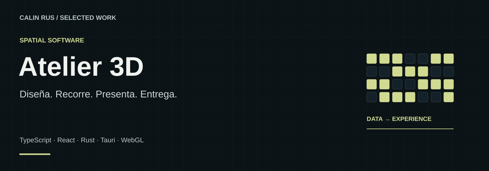

# Atelier 3D

**Diseña. Recorre. Presenta. Entrega.**

Un producto de escritorio para diseñar espacios 3D y convertirlos en experiencias navegables y entregables: imágenes, vídeo, planos PDF a escala y mediciones. La versión 1.0 está terminada y dispone de emisión y renovación de licencias.

**Stack:** TypeScript · React · Rust · Tauri · WebGL  
**Estado:** Producto de escritorio 1.0 · Disponible bajo licencia

[Portfolio](https://github.com/calinrus-dev/portfolio) · [Experiencia](docs/EXPERIENCIA.md) · [Componentes](docs/COMPONENTES.md) · [Diseño técnico](docs/ARQUITECTURA.md) · [Demostraciones](docs/DEMOSTRACIONES.md) · [Estado](docs/ESTADO.md)

## El problema que aborda

Una propuesta espacial necesita resolver tanto el trabajo de diseño como su presentación y entrega. Atelier 3D reúne esos momentos en un estudio de escritorio: construir el espacio, darle ambiente, recorrerlo y preparar material que permita explicarlo.

## Qué compone la experiencia

- **Diseño de espacios.** Estancias, objetos, referencias a escala y acabados para construir la propuesta.
- **Presentación 3D.** Materiales, iluminación y recorridos con capítulos y puntos de visita.
- **Entrega multiformato.** Imágenes, vídeo 1080p, planos PDF a escala y mediciones CSV.
- **Producto bajo licencia.** Aplicación de escritorio 1.0 con emisión y renovación de licencias.

*Lámina explicativa con datos ficticios. Su contenido también está disponible como texto en [Componentes](docs/COMPONENTES.md).*

## Galería real

*Render real de un piso de muestra incluido en una entrega del proyecto.*

*Render real de una escena de estudio. Imagen de resultado, no captura de la interfaz.*

## Decisiones que definen el proyecto

- **Una escena coherente.** La propuesta editada y la presentación comparten una identidad de recursos.
- **La visita comunica.** Capítulos y puntos de interés ayudan a explicar el espacio.
- **Límites verificables.** La lectura geométrica no se presenta como certificación normativa.

## Explorar el caso

- [Experiencia y recorrido](docs/EXPERIENCIA.md): intención, interacción y criterios de revisión.
- [Componentes](docs/COMPONENTES.md): las piezas visibles y el papel de cada una.
- [Diseño técnico](docs/ARQUITECTURA.md): responsabilidades y compromisos de diseño.
- [Demostraciones](docs/DEMOSTRACIONES.md): qué enseñan las imágenes y cómo leer la evidencia.
- [Estado y siguientes pasos](docs/ESTADO.md): alcance actual, comprobaciones y trabajo pendiente.

## Sobre este repositorio

Caso de estudio público de un proyecto con implementación privada. Reúne documentación, diagramas e imágenes seleccionadas. Los detalles del motor, integraciones, datos operativos y código se mantienen en los repositorios privados.

Revisión editorial: 28 de septiembre de 2026. Autor: [Calin Rus](https://github.com/calinrus-dev).

[calinrus.com](https://calinrus.com) · [Instagram @c4linrus](https://www.instagram.com/c4linrus/) · [Todos los proyectos](https://github.com/calinrus-dev/portfolio)
