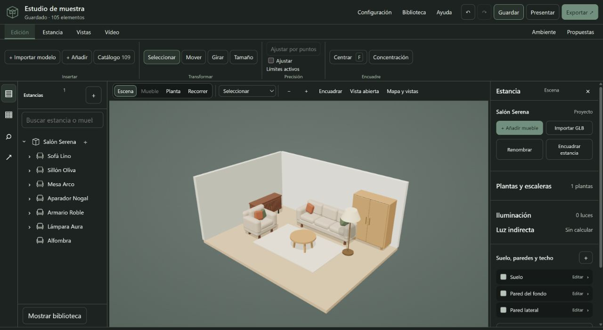

# Atelier 3D / Diseñar. Recorrer. Entregar.

**[Descargar Atelier 3D 1.0 para Windows x64](https://github.com/calinrus-dev/atelier-3d-showcase/releases/tag/v1.0.0)** · [Solicitar licencia de evaluación y participar en QA](https://www.linkedin.com/in/calinrus-dev/). El instalador incluye el producto; la licencia se emite por mensaje privado. La página de descarga incluye SHA-256 y el estado de firma.

**Mi producto principal. Aplicación de escritorio 1.0, disponible bajo licencia.** Un espacio no termina cuando queda bonito en el visor: hay que recorrerlo, presentarlo, medirlo y entregarlo. Atelier reúne ese recorrido en una misma herramienta.

**Tauri · Rust · React · TypeScript · WebGL**

## De la escena a lo que se lleva el cliente

Espacios y piezas, materiales PBR e iluminación, edición por herramientas, recorridos y visitas por capítulos. La entrega continúa con imágenes, vídeo 1080p, planos PDF vectoriales a escala y mediciones CSV. La versión 1.0 incluye emisión y renovación de licencias.

[Ver capturas y resultados reales](docs/DEMOSTRACIONES.md) · [Alcance de la entrega](docs/ESTADO.md)

## Una pieza real que puedes examinar

**El mapa de atajos del editor está publicado.** Normalización de teclas, alias, reservas de navegación y detección de conflictos. Es una pieza pequeña, pero está donde se nota el oficio: repetir una acción cientos de veces sin pelearse con la interfaz.

[**Probar el componente en el navegador →**](https://calinrus-dev.github.io/atelier-3d-showcase/) · [Leer el código](samples/shortcuts.js) · [Casos de prueba](test/shortcuts.test.mjs)

~~~sh
node --test test/*.test.mjs
~~~

Prueba a asignar **Ctrl+Z a Guardar**: debe detectar Deshacer. Una reasignación no puede conservar un alias antiguo por sorpresa. Una combinación de navegación tampoco debe desaparecer porque alguien decidió que «sería cómodo» usar Tab para otra cosa.

## Decisiones con factura

- **Tauri y un visor web:** integración de escritorio y trabajo gráfico sin empaquetar otra distribución completa de Chromium. El coste es probar diferencias del WebView y el límite entre UI y host nativo.
- **Densidad útil:** escena, árbol y propiedades cerca del trabajo. Necesita jerarquía visual, foco y atajos; meter más botones no cuenta como diseño.
- **Entrega fuera del visor:** PDF y CSV obligan a conservar unidades, escala y trazabilidad. Un render no sustituye un plano.

[Arquitectura del producto](docs/ARQUITECTURA.md) · [Componentes de la experiencia](docs/COMPONENTES.md)

## Qué demuestra esto

El componente publicado y sus pruebas se pueden ejecutar sin Atelier. Las capturas documentan el producto. Los registros de entrega son evidencia del autor, no una auditoría independiente. La muestra de teclado no prueba por sí sola el rendimiento 3D, todo el sistema de licencias ni cada exportación.

El producto, el motor, las integraciones y las claves permanecen privados. [Origen y límites](docs/PROVENANCE.md) · [Verificación](docs/VERIFICATION.md) · [Portfolio](https://github.com/calinrus-dev/portfolio)

[Instagram @c4linrus](https://www.instagram.com/c4linrus/) · [LinkedIn / calinrus](https://www.linkedin.com/in/calinrus-dev/)
