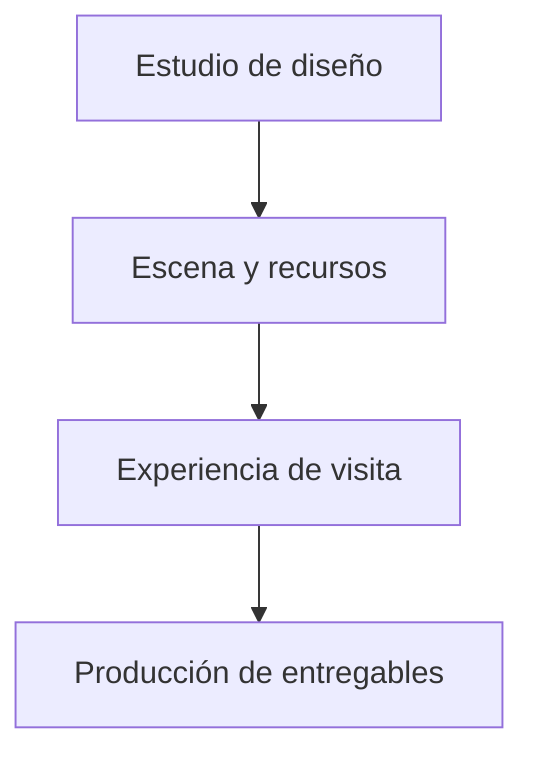

# Atelier 3D / Diseño técnico

[← Inicio](../README.md)

## Contexto

Un producto de escritorio para diseñar espacios 3D y convertirlos en experiencias navegables y entregables: imágenes, vídeo, planos PDF a escala y mediciones. La versión 1.0 está terminada y dispone de emisión y renovación de licencias.

**Tecnologías asociadas al proyecto:** TypeScript · React · Rust · Tauri · WebGL.

## Mapa de responsabilidades

Este mapa conceptual organiza la explicación del producto; no representa endpoints, procesos desplegados ni contratos internos.

## Una escena coherente

La propuesta editada y la presentación comparten una identidad de recursos.

## La visita comunica

Capítulos y puntos de interés ayudan a explicar el espacio.

## Límites verificables

La lectura geométrica no se presenta como certificación normativa.

## Rendimiento y dependencia

Mi criterio de trabajo es medir antes de optimizar: identificar el recorrido relevante, observar tiempo de respuesta y uso de recursos y comparar cambios con la misma carga. En sistemas nativos también me interesa la disposición de datos, la localidad de memoria y el trabajo repetido.

Local-first es una preferencia arquitectónica: conservar una experiencia útil y control sobre los datos en el dispositivo, e incorporar servicios externos cuando aporten una función concreta. Su alcance varía por proyecto; no implica que todas las integraciones de este caso funcionen sin conexión.

No se publican cifras de rendimiento sin un ensayo identificado. La evidencia específica disponible está en [Estado](ESTADO.md).

## Qué conviene demostrar después

- Ampliar el catálogo y los recorridos de edición sobre la versión entregada.
- Mejorar la experiencia de distribución y soporte del producto.
- Continuar la validación de escenas y dispositivos adicionales.
