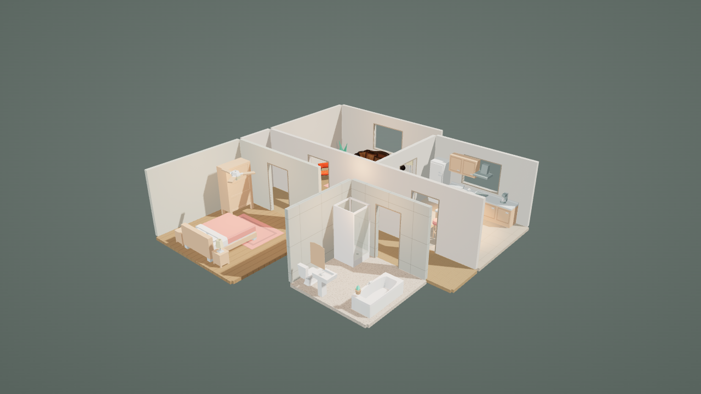
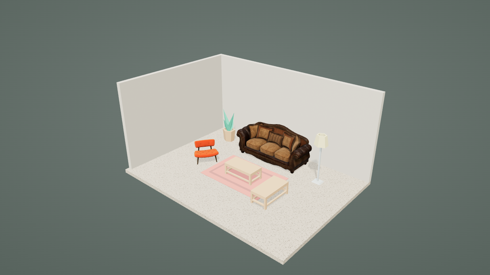
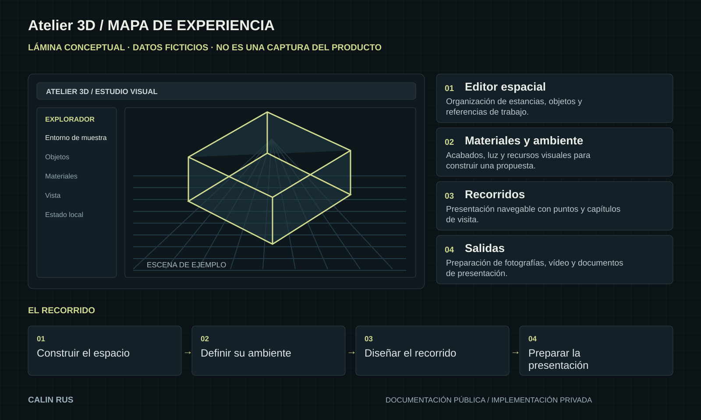

# Atelier 3D / Demostraciones

[← Inicio](../README.md)

## Qué enseña esta publicación

Galería de escenas de muestra incluida en las entregas del proyecto: un estudio y un piso. Son renders del producto, identificados como tales.

La entrega 1.0 documenta recorridos y exportaciones nativas en Windows. Se muestran capacidades del producto sin distribuir instaladores, proyectos editables ni herramientas de emisión de licencias.

## Capturas reales

*Render real de un piso de muestra incluido en una entrega del proyecto.*

*Render real de una escena de estudio. Imagen de resultado, no captura de la interfaz.*

## Guion del caso de estudio

Este guion sirve para explicar el recorrido documentado y preparar una demostración controlada. No afirma que se haya ejecutado completo durante esta publicación.

1. **Diseñar el espacio.** Observar: Estancias, objetos, referencias a escala y acabados para construir la propuesta.
2. **Construir el ambiente.** Observar: Materiales, iluminación y recorridos con capítulos y puntos de visita.
3. **Recorrer la propuesta.** Observar: Imágenes, vídeo 1080p, planos PDF a escala y mediciones CSV.
4. **Entregar la presentación.** Observar: Aplicación de escritorio 1.0 con emisión y renovación de licencias.

## Lectura de la lámina

La ilustración reúne las piezas y sus relaciones. Sus estados, textos de muestra y formas son editoriales. Las capturas reales, cuando existen, aparecen identificadas por separado.

## Evidencia disponible

El propietario confirma la versión terminada y su disponibilidad bajo licencia. La verificación de entrega 1.0 documenta instalación Windows, licencia activa, emisión y renovación, pruebas de aplicación y exportaciones reales de imagen y vídeo. Las imágenes públicas seleccionadas son escenas de muestra existentes. La preview de navegador abierta en esta revisión mostró la interfaz, pero el navegador de revisión no ofreció WebGL 2; no se atribuye ese entorno a una nueva validación del render nativo.

[Alcance y próximos pasos](ESTADO.md)
